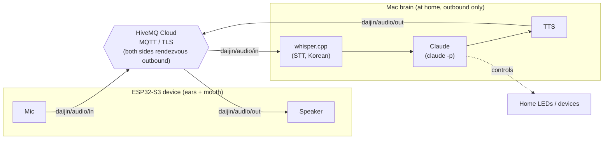

# daijin

> **A lonely developer's friend and assistant.**
> An AI voice-conversation IoT device I built myself, wired into my own systems, that I can tell to do *anything*.

Talk to the device → it goes through the cloud → an AI (**Claude**) thinks → the device answers back in speech.
It doesn't just reply — it **actually controls my home and my computer.**

Built from a single cable up, on an ESP32-S3 (Freenove FNK0082) + a Mac brain + cloud MQTT.

## Architecture (portable — works even when you take it outside)



- **They meet at a cloud broker** → works even when the device is on an outside network. The Mac stays home and only goes outbound (no inbound exposure needed).
- The brain = `claude -p` (it's an agent, so it controls the home's LEDs and devices by voice).

## Extensibility — bolting on other agents (open by design)

daijin **separates the "ears + mouth" (device) from the "brain" (agent) over MQTT topics**. So the brain is swappable, and daijin itself can be used as the *voice I/O device for any agent*.

- **Swap the brain**: anything in place of `claude -p` — OpenAI, Gemini, a local LLM (EXAONE), the Claude Agent SDK, etc. STT/TTS and the device stay the same.
- **Generic voice I/O**: subscribe/publish just the `daijin/text/in` (what I say) and `daijin/text/out` (the reply) topics, and any agent can use daijin as its ears and mouth (daijin handles audio, STT, TTS).
- **Multi-agent routing**: dispatch by transcribed intent to a home-control agent / coding agent / chit-chat agent.
- **MCP integration**: expose daijin's actions (speaking, device control) as MCP tools, or have the brain wire up multiple MCP servers to extend its abilities modularly.

> The topic contract (`daijin/audio/*`, `daijin/text/*`) already acts as the interface, so swapping the brain or attaching an external agent is just *one adapter layer*. (Current brain = Claude; the extensions are roadmap.)

## Current status

- **Remote control**: evolved HTTP (LAN) → MQTT (LAN) → **HiveMQ Cloud (portable)**. Verified controlling home devices from a phone on LTE.
- **daijin brain**: voice → STT → Claude → TTS → voice round-trip, verified end-to-end through the cloud (~7s latency).
- **Next (Phase 2)**: mount an INMP441 mic on the ESP32 so the device listens and speaks directly. → [docs/chunking-protocol.md](docs/chunking-protocol.md)

## Layout

```
sketches/   ESP32 firmware
  01~06               learning sketches (LED/WiFi/servo/sensor)
  10-remote-led       HTTP remote LED (early)
  11-mqtt-led         LAN MQTT
  12*-funnel          Tailscale Funnel attempt (unstable for portable use — kept as a record)
  13-cloud-led        HiveMQ Cloud (portable ✅)
voice/      daijin
  daijin_mqtt.py      brain: MQTT client (STT→Claude→TTS)
  talk.sh             Mac-only voice loop
  led.sh              device control for the voice agent
  test_device.py      fake-device round-trip test
docs/       roadmap·research·protocol
```

## Stack

ESP32-S3 · Arduino (arduino-cli) · MQTT (Mosquitto / HiveMQ Cloud) · TLS (Let's Encrypt) ·
whisper.cpp (STT, Korean) · Claude (brain) · TTS · WiFiManager

## Setup notes

- **No credentials in the code.** `secrets.h`, `secrets.local.txt`, and the whisper model are gitignored — create them with your own values.
- Download the whisper model `ggml-large-v3-turbo-q5_0.bin` into `voice/models/` yourself.

## Key lessons

- ESP32 is **2.4GHz WiFi only**, and the USB connection must be a **data cable**.
- ESP32-S3 TLS needs **NTP time sync** (set a timeout).
- For a portable backend, a **cloud broker** beats a **home Mac + tunnel (unstable)**.

---
*Built with [Claude Code](https://claude.com/claude-code).*
