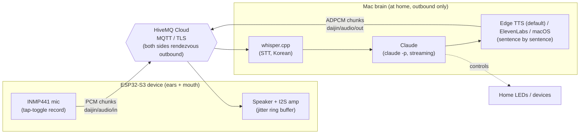

# daijin

> **A lonely developer's friend and assistant.**
> An AI voice-conversation IoT device I built myself, wired into my own systems, that I can tell to do *anything*.

Tap a button, talk to the device → audio travels through the cloud → an AI agent (**Claude**) thinks → the device answers back in speech, in a voice I designed.
It doesn't just reply — it **actually controls my home and my computer.**

Built from a single cable up, on an ESP32-S3 (Freenove FNK0082) + a Mac brain + cloud MQTT.

## How is this different from Siri?

daijin is not "a better Siri." It's a **different kind of thing**.

- **The brain is an agent that reasons and acts, not a command matcher.** Siri pattern-matches fixed commands. daijin's brain is Claude — it holds a real conversation and *acts* on my scripts, MQTT devices, and data through shell access on my Mac.
- **I own it and I can rewire it.** Personality, prompts, and the set of allowed actions are mine to define. Closed assistants (Siri, Alexa, even ChatGPT voice) can't give you an agent that *works inside your own infrastructure*.
- **It's a separate being, not an app on my phone.** Something you place on a desk or carry around. A relationship, not a tool.

→ daijin's differentiation is **ownership + agency**: a fully-owned, open-ended agent device embedded in the systems of my life.

## Architecture (portable — works even when you take it outside)



- **They meet at a cloud broker** → works on any network: home WiFi or a phone hotspot on LTE. The Mac stays home and only goes outbound (no inbound exposure needed).
- **Fully streaming reply pipeline**: Claude's answer is split into sentences *as it generates* → each sentence is synthesized and published immediately → the device starts speaking after the **first sentence**, not the full answer. Honest numbers: a full round trip (record → STT → agent → TTS → playback) typically takes **6–22 s** depending on how much the agent thinks and does — streaming hides part of that, but this is a conversation, not real-time.
- **Audio protocol** ([docs/chunking-protocol.md](docs/chunking-protocol.md)): PCM 16 kHz/16-bit mono, chunked over MQTT with a 4-byte header `[clipId][seq:2][flags]`. Downstream audio is **IMA ADPCM-compressed 4:1** and played through a jitter ring buffer on the device.
- The brain = `claude -p` (it's an agent, so it controls the home's LEDs and devices by voice) with a **pinned session** for cross-conversation memory. **Security trade-off, stated plainly**: the agent runs with broad tool access (shell, file read/write, web search/fetch) so it can genuinely act on the Mac — which means the **MQTT broker credential *is* the security boundary**: anyone who can publish to the audio topic can drive the agent. Mitigations in place: TLS to the broker (certificate verification required), credentials kept only in a gitignored `secrets.local.txt`, the Mac makes outbound connections only, and the system prompt requires spoken confirmation before destructive actions (a soft guard, not a hard one).

### Why ADPCM? (a physics lesson)

The free broker lives in the EU: ~300 ms RTT from Korea. The ESP32's lwIP TCP receive window is ~5.7 KB and fixed. Max throughput = window ÷ RTT ≈ **19 KB/s** — physically below the 32 KB/s that raw PCM playback needs. No amount of code fixes that; compressing to 8 KB/s does.

## Extensibility — bolting on other agents (open by design)

daijin **separates the "ears + mouth" (device) from the "brain" (agent) over MQTT topics**. So the brain is swappable, and daijin itself can be used as the *voice I/O device for any agent*.

- **Swap the brain**: anything in place of `claude -p` — OpenAI, Gemini, a local LLM (EXAONE), the Claude Agent SDK, etc. STT/TTS and the device stay the same.
- **Generic voice I/O**: subscribe/publish just the `daijin/text/in` (what I say) and `daijin/text/out` (the reply) topics, and any agent can use daijin as its ears and mouth (daijin handles audio, STT, TTS).
- **Multi-agent routing**: dispatch by transcribed intent to a home-control agent / coding agent / chit-chat agent.
- **MCP integration**: expose daijin's actions (speaking, device control) as MCP tools, or have the brain wire up multiple MCP servers to extend its abilities modularly.

> The topic contract (`daijin/audio/*`, `daijin/text/*`) already acts as the interface, so swapping the brain or attaching an external agent is just *one adapter layer*. (Current brain = Claude; the extensions are roadmap.)

## Current status

- **Phase 2 shipped** — the device itself listens and speaks: tap BOOT to record, tap again to send; the reply streams back and plays with **zero underruns**, at home or on a phone hotspot outside.
- **Voice**: free **Edge TTS** is the default engine (neural multilingual voice); a custom voice designed on ElevenLabs (streamed as PCM, flash model) is opt-in via `TTS_ENGINE=eleven`, with macOS TTS as the offline-safe final fallback.
- **Device UX**: ready chirp through the speaker, dim-green idle LED, status colors for record/upload/play (LTE connects can take 30+ seconds — sound beats a blinking LED).
- Earlier milestones: HTTP LAN control → MQTT LAN → HiveMQ Cloud portable control (verified from a phone on LTE) → cloud voice round-trip with a fake device.

## Hardware

- **Board**: ESP32-S3-WROOM (Freenove FNK0082 kit) on the GPIO extension board + breadboard
- **Mic**: INMP441 I2S MEMS (WS=1, SCK=2, SD=42, L/R→GND) — must be read as **32-bit I2S frames**, top 16 bits used
- **Speaker**: 8Ω 2W through the kit's Audio Converter & Amplifier module (PCM5102 DAC: BCK=14, LCK=12, DIN=13, SCK unconnected)
- **Power**: USB or a plain power bank — it's a take-it-with-you device

## Layout

```
sketches/   ESP32 firmware (arduino-cli)
  01~06               learning sketches (LED/WiFi/servo/sensor)
  10-remote-led       HTTP remote LED (early)
  11-mqtt-led         LAN MQTT
  12*-funnel          Tailscale Funnel attempt (unstable for portable use — kept as a record)
  13-cloud-led        HiveMQ Cloud (portable ✅)
  14-daijin           the daijin device: mic → cloud → speaker ✅
  test-mic            mic verification (record → HTTP → whisper)
  test-speaker        speaker verification (I2S tone melody)
  mic-diag            auto-sweeps every pin/slot combo to find I2S wiring empirically
voice/      daijin
  daijin_mqtt.py      brain: MQTT client (STT → Claude → streaming TTS → ADPCM chunks)
  daijin_server.py    legacy: old HTTP brain (superseded by daijin_mqtt.py, kept as record)
  talk.sh             legacy: Mac-only voice loop (Phase 0, superseded by daijin_mqtt.py)
  led.sh              device control for the voice agent
  test_device.py      fake-device round-trip test
  mic_test_server.py  HTTP endpoint for mic verification
docs/       roadmap · research · audio protocol
```

## Stack

ESP32-S3 · Arduino (arduino-cli) · MQTT (HiveMQ Cloud, TLS/Let's Encrypt) · whisper.cpp (STT, Korean) ·
Claude CLI (agent brain, stream-json) · Edge TTS (default) / ElevenLabs / macOS TTS · IMA ADPCM · launchd

## Setup notes

- **No credentials in the code.** `secrets.h`, `secrets.local.txt`, and the whisper model are gitignored — create them with your own values.
- Download the whisper model `ggml-large-v3-turbo-q5_0.bin` into `voice/models/` yourself.
- The brain runs as LaunchAgent `com.daijin.brain` (plist copy in `voice/`).

## Key lessons

- ESP32 is **2.4GHz WiFi only**, and the USB connection must be a **data cable**; ESP32-S3 serial needs `CDCOnBoot=cdc`.
- The INMP441 speaks **24-bit-in-32-bit I2S frames** — reading 16-bit frames yields full-scale white noise (`k×512+1` patterns).
- Press-fit header pins are not connections. **Solder them** — and check for solder bridges (a VDD–GND bridge shorts the whole board: "plug GND anywhere and the lights die").
- Breadboard power rails are dead plastic unless something actually feeds them.
- When wiring is uncertain, **don't stare at photos — sweep**: firmware that tries every pin permutation and reports signal levels found our miswiring in one pass (`mic-diag`).
- MQTT **QoS1 gates every message on a broker round-trip** — for real-time audio use QoS0 and let TCP stream.
- `WiFi.setSleep(false)` — or the ESP32's receive throughput silently collapses to ~12 KB/s.
- Bandwidth-delay product is real: far broker × tiny TCP window = a hard throughput ceiling. Compress, or move the broker closer.
- For latency, **stream sentences, not essays**: the user hears the first sentence while the rest is still being thought.
- ESP32-S3 TLS needs **NTP time sync** (set a timeout — LTE carriers often block NTP; fall back gracefully).
- For a portable backend, a **cloud broker** beats a **home Mac + tunnel (unstable)**.

---
*Built with [Claude Code](https://claude.com/claude-code).*
